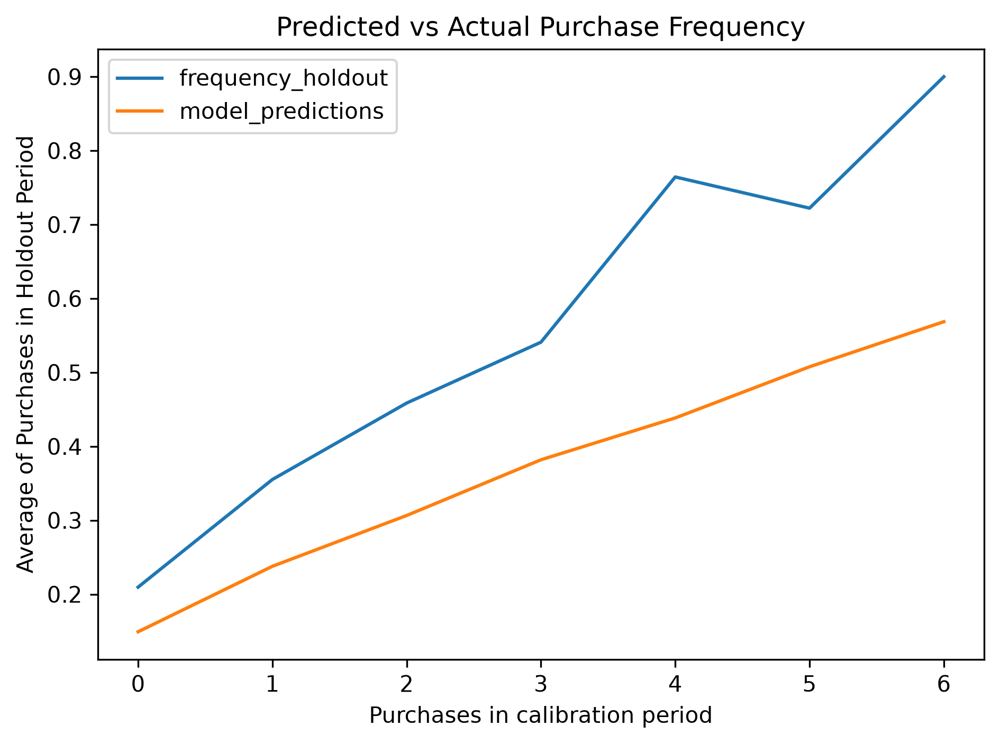
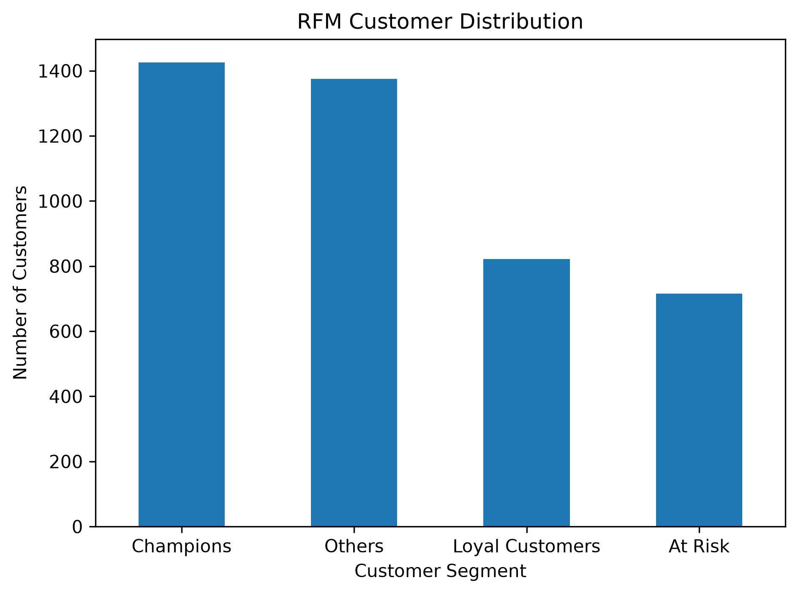
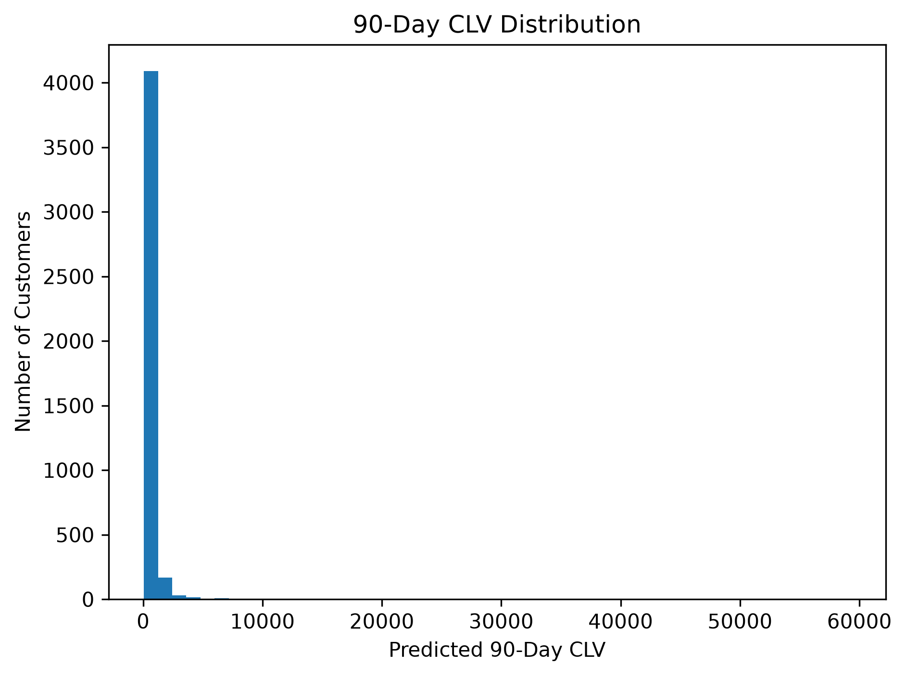
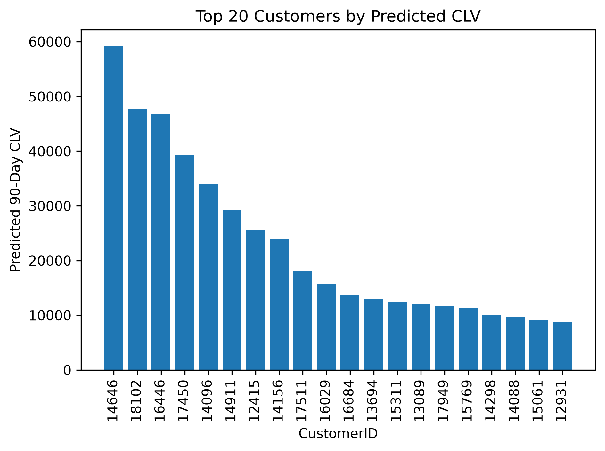
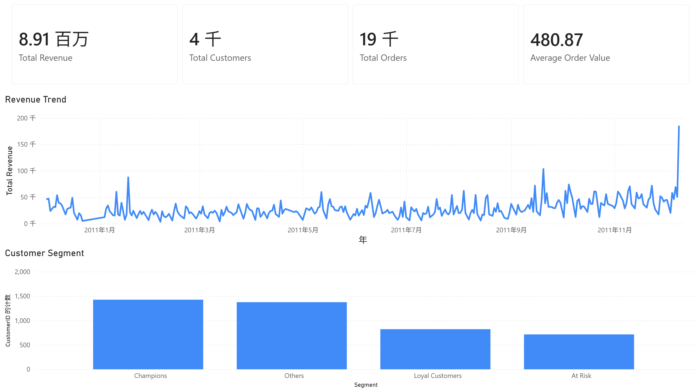
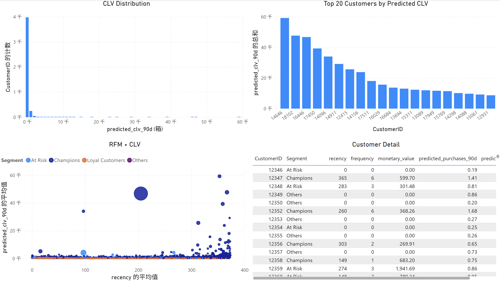

# Retail Customer Value Analytics

Customer analytics portfolio project using **SQL, Python, probabilistic CLV modeling, and Power BI** to identify valuable customer groups and estimate future customer value from retail transaction data.

## Project Overview

This project analyzes customer purchasing behavior using the UCI Online Retail dataset.

The workflow combines:

**Transaction Data → SQL & RFM → Customer Segmentation → BG/NBD → Gamma-Gamma → 90-Day Revenue-Based CLV → Power BI**

The analysis focuses on three business questions:

- Which customers currently generate the most value?
- Which customers are likely to purchase again?
- Which customers should receive higher retention or engagement priority?

## Dataset

**Source:** UCI Machine Learning Repository — Online Retail

The dataset contains transaction-level records from a UK-based non-store retailer between December 2010 and December 2011.

Key fields include:

`InvoiceNo`, `StockCode`, `Description`, `Quantity`, `InvoiceDate`, `UnitPrice`, `CustomerID`, and `Country`.

Raw and processed datasets are excluded from this repository through `.gitignore`.

## Data Preparation

Python was used for basic transaction cleaning:

- Removed transactions without `CustomerID`
- Removed cancelled transactions
- Removed non-positive quantities and unit prices
- Created transaction revenue as:

```text
Revenue = Quantity × UnitPrice
```

The cleaned dataset contains **397,884 transaction rows**.

## SQL & Customer Analytics

DuckDB SQL was used to create customer-level analytical outputs and business KPIs.

### Key Business Metrics

| Metric | Result |
|---|---:|
| Customers | 4,338 |
| Orders | 18,532 |
| Revenue | 8,911,407.90 |
| Average Order Value | 480.87 |
| Repeat Customers | 2,845 |
| Repeat Purchase Rate | 65.58% |

### RFM Segmentation

Customers were analyzed using:

- **Recency** — time since the most recent purchase
- **Frequency** — historical purchase frequency
- **Monetary** — historical customer revenue

Four customer groups were created:

- Champions
- Loyal Customers
- At Risk
- Others

## Probabilistic CLV Modeling

The `lifetimes` Python library was used to model repeat purchasing behavior.

### BG/NBD

BG/NBD estimates future repeat purchases using customer purchase history.

A calibration/holdout validation was performed before generating final predictions.

**Holdout MAE: 0.5138**

### Gamma-Gamma

Gamma-Gamma was fitted on **2,790 returning customers** to estimate expected transaction value.

### 90-Day Revenue-Based CLV

For each customer:

```text
90-Day Revenue-Based CLV
= Predicted 90-Day Purchases × Expected Transaction Value
```

Predictions were generated for all **4,338 customers**.

| CLV Statistic | Value |
|---|---:|
| Mean | 531.64 |
| Median | 274.29 |
| 75th Percentile | 465.36 |
| Maximum | 59,249.01 |

The distribution is strongly right-skewed, indicating that a relatively small group of customers accounts for substantially higher predicted future value.

## Model Validation



The holdout comparison provides a simple out-of-time validation of the BG/NBD purchase-frequency predictions.

## Customer Value Results

### Customer Segmentation



### CLV Distribution



### Highest Predicted Customer Value



## Power BI Dashboard

A two-page Power BI dashboard was developed to translate the analysis into business-facing customer insights.

### Customer Overview

Includes:

- Total Revenue
- Total Customers
- Total Orders
- Average Order Value
- Monthly Revenue Trend
- Customer Segment Distribution



### CLV Analysis

Includes:

- CLV Distribution
- Top 20 Customers by Predicted CLV
- RFM × CLV Analysis
- Customer-Level Detail Table



The editable Power BI file is available at:

```text
dashboard/customer_value_dashboard.pbix
```

## Repository Structure

```text
customer-value-analytics/
│
├── README.md
├── project_log.md
│
├── sql/
│   ├── 01_clean_transactions.sql
│   ├── 02_customer_rfm.sql
│   └── 03_customer_kpis.sql
│
├── src/
│   ├── prepare_data.py
│   ├── run_sql.py
│   └── segment_rfm.py
│
├── notebooks/
│   └── 01_rfm_clv_analysis.ipynb
│
├── dashboard/
│   └── customer_value_dashboard.pbix
│
├── reports/
│   ├── rfm_customer_distribution.png
│   ├── predicted_vs_actual_purchase_frequency.png
│   ├── clv_distribution.png
│   ├── top_customers_by_clv.png
│   ├── dashboard_overview.png
│   └── dashboard_clv.png
│
└── data/
    ├── raw/
    └── processed/
```

## How to Run

1. Download the UCI Online Retail dataset.
2. Place `Online Retail.xlsx` in:

```text
data/raw/
```

3. Prepare the cleaned transaction data:

```bash
python src/prepare_data.py
```

4. Run the SQL analyses:

```bash
python src/run_sql.py
```

5. Create customer segments:

```bash
python src/segment_rfm.py
```

6. Run:

```text
notebooks/01_rfm_clv_analysis.ipynb
```

using the project Python environment.

## Business Interpretation

The project provides a compact customer-value framework that can support:

- High-value customer identification
- Retention prioritization
- Customer segmentation
- Repeat-purchase analysis
- Customer-value-based marketing prioritization

In particular, customers with high historical value but weaker recent activity can be separated from consistently loyal customers, while probabilistic CLV provides a forward-looking complement to traditional RFM analysis.

## Limitations

- The dataset contains transaction revenue rather than customer profitability, so the reported CLV is a **revenue-based CLV measure**, not profit-based CLV.
- The analysis represents a non-contractual retail setting and does not observe explicit customer churn.
- BG/NBD and Gamma-Gamma rely on behavioral assumptions that may not fully capture promotions, seasonality, or changing customer preferences.
- The analysis is intended for customer prioritization and descriptive/predictive analytics rather than causal inference.

## Tech Stack

**SQL:** DuckDB  
**Python:** pandas, NumPy, lifetimes, scikit-learn, matplotlib  
**BI:** Power BI  
**Development:** Jupyter, Cursor, Git, GitHub